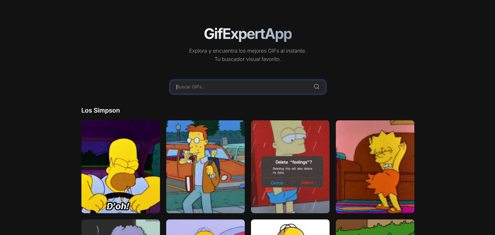

# 🎬 Gif Expert App

Un **Buscador de GIFs Premium** construido con React. Experimenta una forma cinematográfica de descubrir y compartir GIFs, con un elegante **Modo Oscuro Carbon** y animaciones inmersivas.


> *Una implementación elegante de un buscador de GIFs consumiendo la API de GIPHY.*

## ✨ Características Principales

- **🔍 Búsqueda Inteligente**: Encuentra GIFs al instante usando la API de GIPHY.
- **🌑 Diseño Carbon**: Un tema oscuro profesional y de alto contraste (`#121212`) diseñado para el confort visual.
- **🧱 Layout Masonry**: Una cuadrícula dinámica "estilo Bento" que se adapta a las diferentes relaciones de aspecto de las imágenes.
- **🍿 Modo Cine (Lightbox)**:
  - Transiciones de layout fluidas usando **Framer Motion**.
  - **Bloqueo de Scroll**: Enfócate puramente en el contenido; el scroll del fondo se desactiva.
  - **Contenido Relacionado**: Descubre "Más como esto" directamente dentro del modal con descubrimiento infinito.
  - **Acciones Inteligentes**: Ve la fuente original con un solo clic.

## 🛠️ Stack Tecnológico

Este proyecto aprovecha un stack moderno de desarrollo web:

### Core
- **[React 18](https://reactjs.org/)**: Arquitectura de UI basada en componentes.
- **[Vite](https://vitejs.dev/)**: Herramientas de frontend de próxima generación.
- **JavaScript (ES6+)**: Lógica funcional y manejo de datos asíncronos.

### UI & Estilos
- **Variables CSS3**: Tematización avanzada para la paleta de colores Carbon.
- **[Framer Motion](https://www.framer.com/motion/)**: Animaciones listas para producción y transiciones de layout compartidas.
- **[React Icons](https://react-icons.github.io/react-icons/)**: Set de iconos ligero.

### Datos
- **[GIPHY API](https://developers.giphy.com/)**: Obtención de datos asíncrona.
- **Custom Hooks**: Lógica encapsulada (`useFetchGifs`) para componentes limpios.

---

## 🚀 Empezando

Clona el proyecto e inicia el servidor de desarrollo localmente:

```bash
# 1. Clonar el repositorio
git clone https://github.com/tu-usuario/gif-expert-app.git

# 2. Entrar en el directorio
cd gif-expert-app

# 3. Instalar dependencias
npm install

# 4. Iniciar servidor de desarrollo
npm run dev
```

## 🧪 Testing

El proyecto está configurado con **Jest** y **React Testing Library**:

```bash
npm run test
```

## 📂 Estructura del Proyecto

```
src/
 ├── components/      # Componentes atómicos (GifItem, GifGrid, RelatedGifs...)
 ├── helpers/         # Fetchers de API (getGifs.js)
 ├── hooks/           # Custom hooks (useFetchGifs.js)
 ├── styles.css       # Estilos globales Carbon & Variables
 └── GifExpertApp.jsx # Entrada principal de la aplicación
```

---

<p align="center">
  Hecho con 💙 y React
</p>
